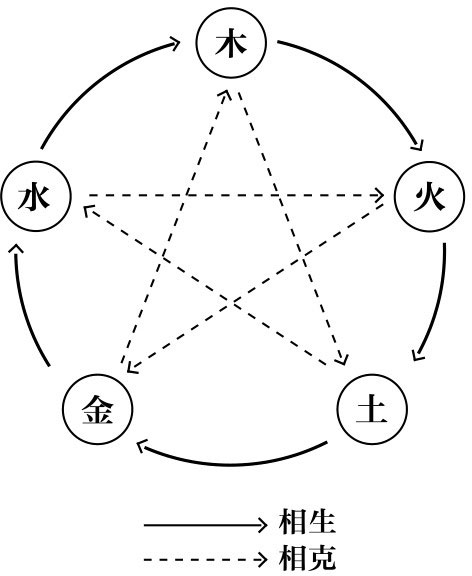
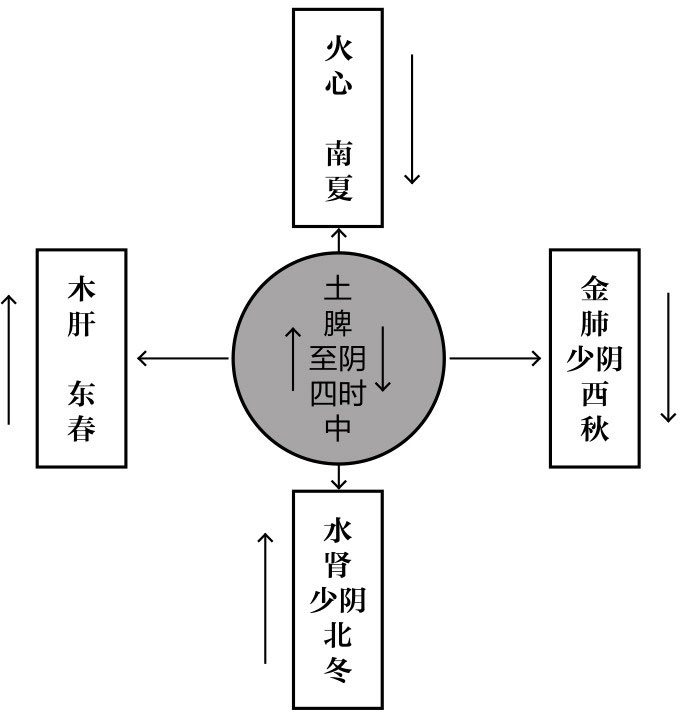
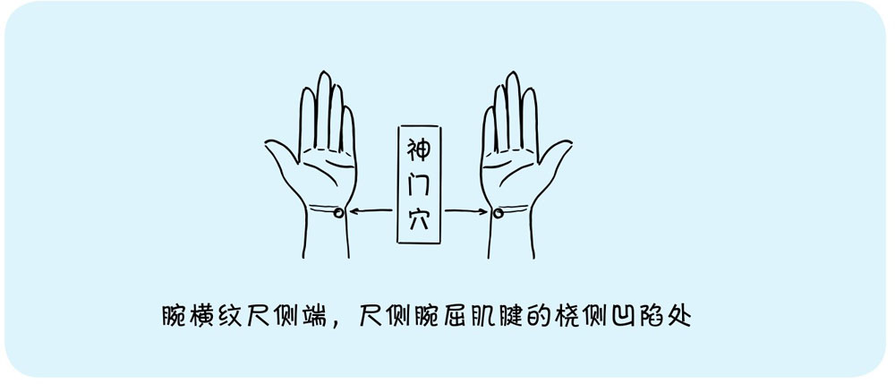

# 阴阳和五行

## 阴阳
  - 阴气主凉润、宁静、抑制、沉降。阳气主温煦、推动、兴奋、升发。
  - 一般来说，大气中的六淫（风、火、暑、湿、燥、寒）为阳邪。而饮食不当、情志失调为阴邪。但六淫中又分阴阳，风、火、暑、燥为阳邪；湿、寒为阴邪。阳邪易防，阴邪难挡。在常见病中，但凡是阳邪致病的，都好治。而阴邪致病的，就很难痊愈。
  - 阴阳偏盛
    - 即阴偏盛、阳偏盛。指阴、阳任何一方高于了正常水平的病理状态。
    - 阴盛则寒。阴偏盛，则会出现面白形寒、脘腹冷痛、泻下清稀，舌质淡红苔白，脉沉实或者沉紧等实寒证的表现。
    - 阳盛则热。阳偏盛，则会出现高热、烦躁、面赤、脉数等实热证的表现。
    - 多出的邪气叫“实证”。
  - 阴阳偏虚
    - 即阴虚、阳虚，指阴、阳中的任何一方低于正常水平的病理状态。
    - 阳代表温暖，当阳虚时，身体就会出现很多寒证，表现为阴偏盛的假象。症见面色苍白、畏寒肢冷、神疲蜷卧、自汗、脉微等虚寒证。
    - 阴代表凉润，当阴虚时，身体就会出现很多热证，表现为阳偏盛的假象。症见低热、潮热、盗汗、五心烦热、舌红少苔、脉细数等虚热证。
    - 一个少了反而显得另一个多了，是假象，是虚证。
    - 判断虚实
      - 脉：实证时，脉比较洪大有力；虚证时脉比较细弱无力。
      - 病程：起病急、发展快的，多为实证。病程时间长、发展缓慢的，多为虚证。
  - 阴阳互损
    - 因为阴阳相生，阴虚时间久了，生阳的能力就会变弱，导致阳也低于了正常水平。同样，阳虚时间久了，生阴的能力也会变弱，导致阴也低于了正常水平。两个都低了，就是我们常说的阴阳皆虚。
    - 阴阳皆虚会表现为身体整体功能下降，阴虚和阳虚的症状都有一点儿，整个机体水平处在比较低的阶段。

## 五行
  - 五行学说作为一种思维方法用于中医学，可以解释很多局部与整体、局部与局部、体表与脏腑之间的各种复杂关系
  - 
  - 五行之间有母子关系，所以包含**母病及子**和**子病及母**的情况
  - 

# 心

## 心主血藏神
  - 气，血，脉：心气充沛，血液充盈，脉道通利
  - 心主神智，主管意识、精神和思维 ❓
    - 心神无法收回，失眠、心烦、心悸，按揉神门穴5分钟，可以有效收回心神，让心得以平静
    - 

# 肺

# 肝

# 肾

# 六腑